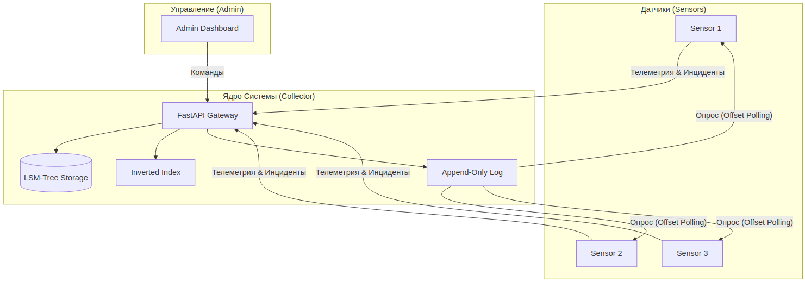

# ⚡ Smart Grid Telemetry: Презентация Проекта

Добро пожаловать в презентацию высоконагруженной системы мониторинга и управления региональной электросетью. Данный проект объединяет в себе передовые алгоритмы хранения данных, распределенную архитектуру и современные веб-интерфейсы.

---

## 🏗️ Общая Архитектура

Система построена на принципах микросервисной архитектуры и оптимизирована для работы в условиях высокой нагрузки (Extreme Write-Heavy).



---

## 🚀 Ключевые Технологии и Алгоритмы

### 1. LSM-Tree (Log-Structured Merge-Tree)
Выбор пал на LSM-Tree вместо традиционных B-Tree из-за экстремальной нагрузки на запись (500,000+ RPS).
*   **MemTable**: Быстрая запись в оперативную память.
*   **WAL (Write-Ahead Log)**: Гарантия сохранности данных при сбоях (Durability).
*   **SSTables**: Иммутабельные файлы на диске, отсортированные по ключам.
*   **Bloom Filters**: Проверка существования ключа без обращения к диску (O(1)).
*   **Sparse Indexing**: Разреженный индекс для мгновенного поиска внутри файлов.

### 2. Append-Only Log (Command Bus)
Шина команд реализована как последовательный лог.
*   **Масштабируемость**: Каждый датчик читает лог независимо, используя свой `offset`.
*   **Надежность**: Команды никогда не теряются и доступны для аудита.

### 3. Inverted Index (Полнотекстовый поиск)
Используется для индексации отчетов об инцидентах, которые динамически генерируют датчики.
*   **Скорость**: Поиск по ключевым словам за константное время O(1).
*   **Динамика**: Автоматическое обновление индекса при поступлении новых данных.

---

## 📈 Основные Возможности

> [!NOTE]
> **Real-time Мониторинг**: Администратор видит состояние всех датчиков (ВКЛ/ВЫКЛ) и время их последней активности.

> [!TIP]
> **Автодополнение (Keywords Dropdown)**: Система сама подсказывает доступные ключевые слова для поиска инцидентов, основываясь на данных в индексе.

### Функционал Датчиков:
-   **Адаптивная передача**: Датчики шлют данные только в активном состоянии.
-   **Автономная диагностика**: Генерация и отправка отчетов об аномалиях (перегрузки, падения напряжения).
-   **Обратная связь**: Постоянный опрос командного центра для изменения режимов работы.

---

## 🛠️ Развертывание и Масштабирование

Проект полностью контейнеризирован с помощью **Docker** и **Docker Compose**.

1.  **Collector**: Масштабируется горизонтально.
2.  **Sensors**: Могут быть запущены в любом количестве экземпляров.
3.  **Persistence**: Все данные хранятся в именованных томах (Docker Volumes).

```bash
docker compose up -d --build
```

---

## 🌟 Итоги
Данная система демонстрирует, как классические алгоритмы (LSM, Inverted Index) эффективно решают современные задачи интернета вещей (IoT) и промышленной автоматизации, обеспечивая баланс между производительностью и надежностью (AP-дизайн по CAP-теореме).
